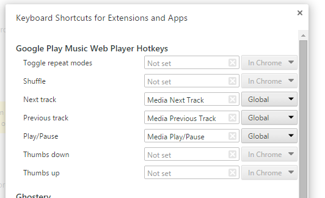
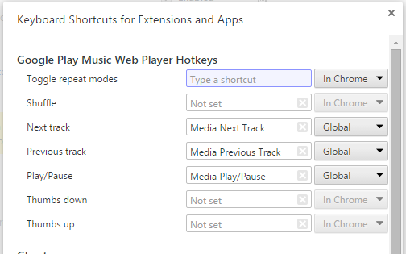
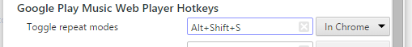

# Hotkeys for Google Play Music&trade; Web Player
Hotkeys for Google Play Music&trade; Web Player is a Google Chrome Extension
 that adds keyboard shortcuts to Chrome, allowing you to **Pause**, play
 **Next** and **Previous** tracks in the
 [Play Music&trade; Web Player](https://play.google.com/music/listen). Additional
 hotkey combinations can be configured for **Ratings** and toggling **Repeat**
 and **Shuffle** modes.

The extension simply enhances the web player interface.

## Hotkeys
The default hotkeys are set globally, and are mapped to your keyboard's media
 keys (much like the Google Play Music&trade; Chrome Extension). This means that they
 will work system-wide, as long as Chrome is open. If you prefer to change this
 behaviour to only when Chrome is the active window, then set it to **In Chrome**.

**Note**: There is an issue where having Microsoft Mouse & Keyboard Center
 installed will prevent Chrome from
 [registering the media keys](https://code.google.com/p/chromium/issues/detail?id=405366).
 You can either uninstall Microsoft Mouse & Keyboard Center :sweat:, or remap
 the hotkeys.

To set the hotkeys, go to ``chrome::extensions`` and scroll down to the bottom
 till you see ``Keyboard Shortcuts``.

Then a popup will appear, allowing you to configure your own hotkeys.

Click the textbox, and then press the key combination.

Done.

Due to Chrome limitations, all hotkeys must begin with ``Ctrl`` or ``Alt`` (the
 ``Shift`` modifier key is optional).

## Disclaimer
Google Play Music&trade; is a trademark of Google Inc. Use of this trademark is subject
 to Google Permissions.

Google Chrome is a trademark of Google Inc. Use of this trademark is subject to
 Google Permissions.

The headphones icon comes from Google's
 [Material Design Icons](https://github.com/google/material-design-icons) library.
